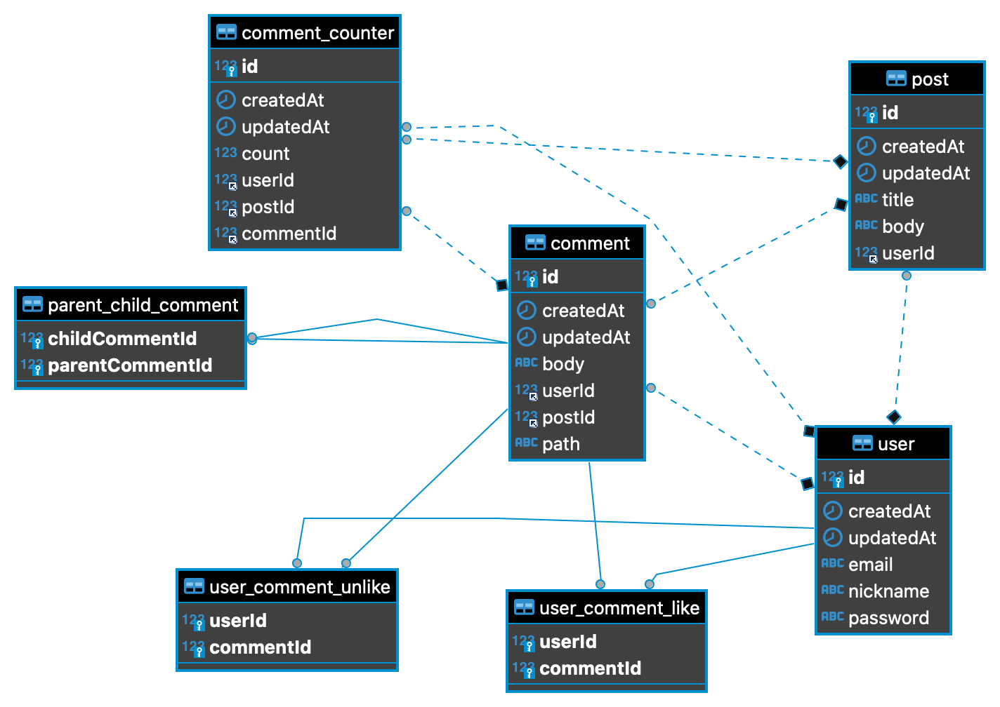

# CIZION 댓글 API

댓글 API 서버입니다.


## 기능

- 회원가입, **로그인**
- 게시글 CRUD
- **댓글 CRUD**
  - **좋아요**, **싫어요**
  - **대댓글** ...
  - **금지어 필터링**
  - **도배 방지**

## 사용 기술

- `Node.js`, `TypeScript`
- `InversifyJS`, `Express`
- `TypeORM`
- `Mysql`
- `Insomnia API Docs`

## 프로젝트 구조


```
src
├── @types
│   └── express                     -> 타입 재정의
├── app                             -> http 서버 애플리케이션
│   ├── middlewares                 -> 애플리케이션 레벨의 미들웨어
│   │   ├── auth
│   │   └── error
│   └── modules                     -> API 모듈
│       ├── auth-module             -> 인증 API 모듈
│       ├── comment-module          -> 댓글 API 모듈
│       ├── image-module            -> 이미지 업로드 API 모듈
│       ├── post-module             -> 게시글 API 모듈
│       └── user-module             -> 사용자 API 모듈
├── common                          -> 공통사항
│   ├── configs                     -> 설정
│   ├── exceptions                  -> HTTPException
│   └── utils                       -> 유틸리티
├── database                        -> 데이터베이스
│   └── entities                    -> 데이터베이스 엔티티
├── di                              -> 의존성 주입
├── interfases                      -> DTO
└── repositories                    -> 레포지토리
```

## ERD

</img>

## 실행

1. clone후 `npm install`
2. .env 파일 생성
   
    ```
    HOST=127.0.0.1
    PORT=9000

    LOG_LEVEL=debug

    JWT_SECRET=bbak
    ACCESS_TOKEN_EXPIRES_IN=8h

    DB_HOST=
    DB_PORT=
    DB_USERNAME=
    DB_PASSWORD=
    DB_NAME=cizion

    ```
3. 데이터베이스 생성 `CREATE DATABASE cizion default CHARACTER SET utf8mb4;`
4. `npm run dev`

## API

1. `npm run docs`
   
   스크립트 실행 후 API 페이지입니다.  http://localhost:5000 